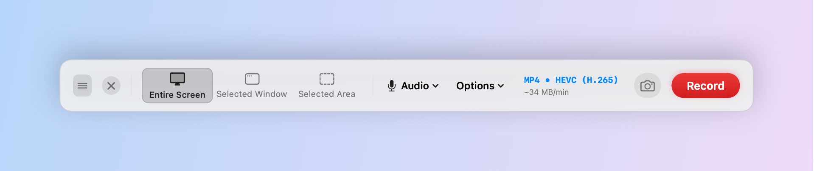
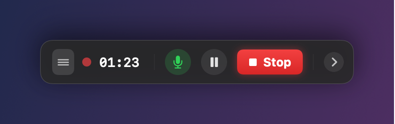
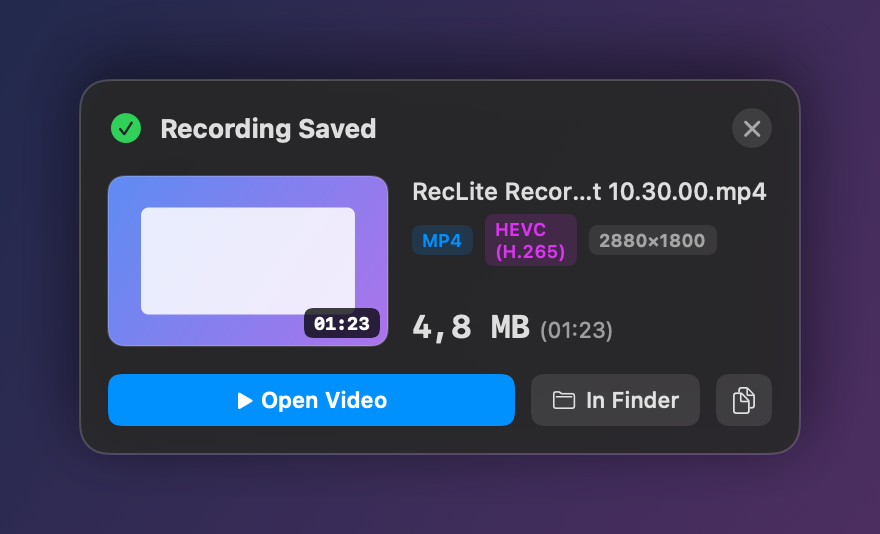
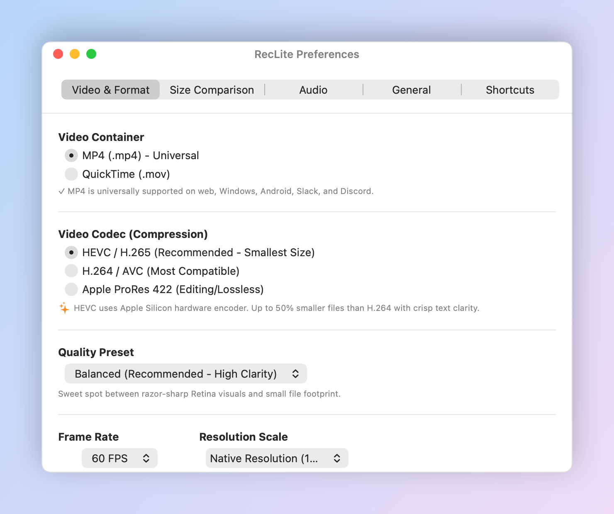

# RecLite (for macOS)

<p align="center">
  <picture>
    <source media="(prefers-color-scheme: dark)" srcset="docs/images/control-bar-dark.png">
    
  </picture>
</p>

A native, ultra-high-performance macOS screen recording application built with **Swift**, **ScreenCaptureKit**, and **AVFoundation**.

Designed to replicate the seamless user experience of macOS's built-in screen recording (`Command + Shift + 5`) while solving its biggest limitation: **giant, heavyweight uncompressed `.mov` files**.

> 📦 **[Installation guide →](#-installation-build-from-source)** — clone, build, and install in a few minutes.
>
> 📋 See [ROADMAP.md](./ROADMAP.md) for known issues, missing features, and what's planned next.

---

## 🚀 Why RecLite?

| Feature | macOS Built-in Screen Recording | **RecLite** |
| :--- | :--- | :--- |
| **Output Container** | Fixed `.mov` only | **MP4 (`.mp4`) & QuickTime (`.mov`)** |
| **Video Codec** | Uncompressed / High-bitrate Apple ProRes/H.264 | **HEVC (H.265), H.264 (AVC), ProRes 422** |
| **File Weight (5 min 1080p)** | **~350 MB – 1.2 GB** 🛑 | **~15 MB – 45 MB** ⚡ *(Up to 95% smaller!)* |
| **Web Compatibility** | Needs re-encoding for web/Discord/Slack | **Instant sharing (Universal MP4)** |
| **Performance** | Native | **Native zero-copy ScreenCaptureKit + Apple Silicon Hardware Encoders** |
| **Controls** | Floating pill bar | **Floating glassmorphic pill bar + Menu Bar status item** |
| **Capture Modes** | Entire Screen, Window, Cropped Area | **Entire Screen, Window, Draggable Cropped Area** |
| **Audio** | Mic or None | **Microphone + System Audio (SCK zero-latency) with live VU meters** |
| **Installation** | System built-in | **Drag & Drop DMG Installer + In-App Move-to-Applications Window** |

---

## 🌟 Key Features

1. **Drag & Drop Installation & Automatic Setup**:
   - **Distribution DMG Package**: Generates `RecLite-Installer.dmg` with customized Finder window bounds, custom icon layout, and direct drag target to `/Applications`.
   - **In-App Install Prompt**: When launched from `~/Downloads` or outside `/Applications`, a glassmorphic prompt opens allowing users to drag the app icon to `/Applications` or click "Move to Applications" for zero-friction installation & auto-relaunch.

2. **Custom Video Container & Codec Selection**:
   - **MP4 (`.mp4`)**: Universally playable in any browser, Android, Windows, Slack, Discord, and messaging apps without re-encoding.
   - **HEVC / H.265**: Uses Apple Silicon hardware encoders for up to **50% smaller file size** compared to H.264 at identical visual clarity.
   - **H.264 / AVC**: Universal legacy compatibility across all players.
   - **Apple ProRes 422**: For professional lossless video editing workflows.

3. **Quality & Compression Presets**:
   - **Ultra Compact**: Tuned for Discord, Slack, and email uploads (~3 Mbps for 1080p60, files under 15 MB).
   - **Balanced (Default)**: Sweet spot between razor-sharp Retina text and small file footprint (~7 Mbps for 1080p60).
   - **High Quality**: Near-source quality for crisp gradients and design demos (~16 Mbps for 1080p60).
   - **Custom Bitrate**: Configure exact Mbps from 1 to 50 Mbps.

4. **Floating Control Bar (`Cmd+Shift+5` experience)**:
   - Full screen, specific window, and interactive cropped area selection.
   - Quick format badge (e.g. `MP4 • HEVC ~18 MB/min`).
   - Options menu for fast switching of codecs, framerates (60/30/24 fps), countdown timer, and audio sources.

5. **Interactive Area Selection Overlay**:
   - Dimmed backdrop with crystal-clear crop cutout.
   - Draggable & resizable with live dimension indicator (`1920 × 1080 (16:9)`).
   - Aspect ratio preset buttons (1080p, 720p, 1:1 square).

6. **Live Recording HUD**:
   - Compact status pill with flashing red recording indicator.
   - Live elapsed timer and **real-time file size counter** (`2.4 MB`).
   - Dynamic animated audio level meter.
   - One-click `Stop` button.

7. **Post-Recording Completion Sheet**:
   - Instant video thumbnail preview.
   - Exact file size and **Storage Saved %** badge compared to default macOS MOV.
   - Quick actions: "Open Video", "Show in Finder", "Copy Video File".

---

## 📸 Screenshots

| Recording HUD | Recording Saved |
| :---: | :---: |
|  |  |

<p align="center">
  
</p>

> Images are rendered from the real SwiftUI views — regenerate them with `./scripts/generate_readme_images.sh` (see below).

---

## 📦 Installation (Build from Source)

> [!NOTE]
> RecLite is **not signed with an Apple Developer ID or notarized**, so there is no prebuilt download — you build it on your own Mac. It takes a few minutes, and because the app is built locally (not downloaded), macOS Gatekeeper won't block it.

### Requirements

- **macOS 14 Sonoma** or newer (*Show Mouse Clicks* requires macOS 15+)
- **Xcode 15+** installed at `/Applications/Xcode.app` — the full Xcode app, not just the Command Line Tools (the build uses Xcode's SwiftUI macro plugin)
- **Git**

First time using Xcode? Open it once to finish installing components, then run:

```bash
sudo xcode-select -s /Applications/Xcode.app/Contents/Developer
sudo xcodebuild -license accept
```

### Step 1 — Clone the repository

```bash
git clone https://github.com/tranlehaiquan/RecLite.git
cd RecLite
```

### Step 2 — Build the app

```bash
./build_app.sh
```

This compiles a release build and creates **`RecLite.app`** in the project folder. The first build can take a couple of minutes.

<details>
<summary>About code signing (why you may need to re-grant permissions after rebuilding)</summary>

`build_app.sh` signs the app automatically:

- If an **Apple Development** certificate is in your keychain, it's used. You can get one for free: Xcode → **Settings → Accounts** → add your Apple ID → **Manage Certificates** → **+ Apple Development**. With this, macOS remembers RecLite's permissions across rebuilds.
- Otherwise it falls back to an **ad-hoc** signature. The app works the same, but macOS treats every rebuild as a new app, so you'll need to re-enable Screen Recording after each rebuild (see [Troubleshooting](#-troubleshooting)).

</details>

### Step 3 — Move it to Applications

```bash
ditto RecLite.app /Applications/RecLite.app
open /Applications/RecLite.app
```

Alternatively, drag `RecLite.app` into `/Applications` in Finder — or just launch it from the project folder and click **Move to Applications** in the prompt that appears.

> RecLite is a **menu bar app**: it has no Dock icon. Look for the ⏺ record icon in the menu bar, and the floating control bar at the bottom of the screen.

### Step 4 — Grant permissions

| Permission | Needed for | How to grant |
| :--- | :--- | :--- |
| **Screen & System Audio Recording** | Recording and screenshots (required) | `System Settings` → `Privacy & Security` → `Screen & System Audio Recording` → enable **RecLite**, then **quit and reopen RecLite** (macOS only applies this after a relaunch) |
| **Microphone** | Recording your voice | macOS asks automatically the first time you record with *Microphone* or *Mic + System Audio* — click **Allow** |
| **Accessibility** | Global keyboard shortcuts while another app is in front | `System Settings` → `Privacy & Security` → `Accessibility` → click **+**, choose `/Applications/RecLite.app`, and enable it |

You're ready — press **Record** on the control bar. 🎬

### Updating

```bash
cd RecLite
git restore RecLite.app RecLite-Installer.dmg   # discard your local build so the pull doesn't conflict
git pull
./build_app.sh
ditto RecLite.app /Applications/RecLite.app
```

Quit RecLite from the menu bar icon before copying, then reopen it.

### Uninstalling

```bash
rm -rf /Applications/RecLite.app
defaults delete com.reclite.app          # removes saved settings
tccutil reset All com.reclite.app        # removes granted permissions
```

---

## 🩺 Troubleshooting

- **Screen Recording is enabled but recording fails or the video is black** — usually happens after a rebuild with an ad-hoc signature. Select RecLite in `Screen & System Audio Recording`, remove it with **–**, then relaunch RecLite and grant it again. Or reset it from Terminal:
  ```bash
  tccutil reset ScreenCapture com.reclite.app
  ```
- **Keyboard shortcuts only work when RecLite is focused** — grant **Accessibility** permission (see Step 4).
- **`xcrun: error` or `unable to find utility` during build** — Xcode isn't selected as the active developer directory; run the `xcode-select` command from [Requirements](#requirements).
- **"RecLite can't be opened because Apple cannot check it"** — this only appears if the app was downloaded rather than built locally. Right-click the app → **Open**, or run `xattr -dr com.apple.quarantine /Applications/RecLite.app`.

---

## 🛠 Project Structure

```
RecLite/
├── Package.swift                             # SPM manifest (macOS 14+)
├── build_app.sh                              # Release build and .app packager script
├── create_dmg.sh                             # Creates RecLite-Installer.dmg with drag & drop layout
├── RecLite.app/                              # Built macOS Application Bundle (output of build_app.sh)
├── RecLite-Installer.dmg                     # Generated macOS DMG installer
├── Resources/AppIcon.icns                    # App icon (all macOS sizes)
├── docs/images/                              # README images (generated)
├── scripts/
│   ├── generate_icon.swift                   # Renders the app icon with CoreGraphics
│   └── generate_readme_images.sh             # Renders README images from the real SwiftUI views
├── Sources/
│   └── ScreenRecorder/
│       ├── main.swift                        # Application entry point
│       ├── App/
│       │   ├── AppDelegate.swift             # App lifecycle, NSStatusItem & panels
│       │   └── AppState.swift                # Central observable state & engine coordinator
│       ├── Models/
│       │   ├── VideoFormat.swift             # Container, Codecs, Presets & File size estimator
│       │   ├── AppSettings.swift             # UserDefaults preferences persistence
│       │   ├── RecordingTarget.swift         # Display, Window, and Area targets
│       │   └── RecordingResult.swift         # Result metadata & savings calculation
│       ├── Engine/
│       │   ├── AppInstaller.swift            # Drag & drop / Applications move & relaunch engine
│       │   ├── ScreenCaptureEngine.swift     # ScreenCaptureKit zero-copy pipeline
│       │   ├── AudioCaptureEngine.swift      # Microphone capture & live audio metering
│       │   ├── VideoWriterEngine.swift       # AVAssetWriter hardware encoder
│       │   └── PermissionsManager.swift      # Screen & Mic permissions handling
│       └── UI/
│           ├── InstallPromptView.swift       # Glassmorphic drag-and-drop installer window
│           ├── FloatingControlBarView.swift  # Floating pill bar (Cmd+Shift+5 style)
│           ├── AreaSelectionOverlay.swift    # Interactive crop area selection window
│           ├── RecordingHUDView.swift        # Live recording status HUD, pause & stop
│           ├── ScreenshotThumbnailView.swift # Floating screenshot thumbnail (open / drag / copy)
│           ├── SettingsView.swift            # Preferences & File size comparison matrix
│           └── CompletionCardView.swift      # Post-recording summary card
└── Tests/
    └── ScreenRecorderTests/
        ├── ScreenRecorderTests.swift         # Unit tests for codecs, bitrates & installers
        └── ReadmeImageTests.swift            # Offscreen renderer for docs/images (opt-in)
```

---

## 🧑‍💻 Development

### Create the Drag-and-Drop DMG Installer
```bash
./create_dmg.sh
open RecLite-Installer.dmg
```

### Regenerate README Images
```bash
./scripts/generate_readme_images.sh
```
Renders the control bar (light & dark), recording HUD, completion card, and Preferences window offscreen into `docs/images/`. No screen capture or permissions needed — rerun after any UI change.

### Regenerate the App Icon
```bash
swift scripts/generate_icon.swift Resources/AppIcon-1024.png
```

### Run Unit Tests
```bash
DEVELOPER_DIR=/Applications/Xcode.app/Contents/Developer swift test
```
